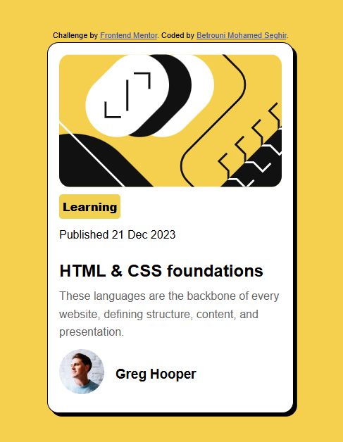

# Frontend Mentor - Blog preview card solution
This is a solution to the [Blog preview card challenge on Frontend Mentor](https://www.frontendmentor.io/challenges/blog-preview-card-ckPaj01IcS). Frontend Mentor challenges help you improve your coding skills by building realistic projects. 

## Table of contents
- [Overview](#overview)
  - [The challenge](#the-challenge)
  - [Screenshot](#screenshot)
  - [Links](#links)
- [My process](#my-process)
  - [Built with](#built-with)
  - [What I learned](#what-i-learned)
  - [Continued development](#continued-development)
  - [Useful resources](#useful-resources)
- [Author](#author)

## Overview
This is my solution to the [Blog preview card challenge on Frontend Mentor]. During this process, I used HTML and CSS to design a responsive layout.
### The challenge
Users should be able to:
- See hover and focus states for all interactive elements on the page

### Screenshot

### Links
- Solution URL: [Add solution URL here](https://your-solution-url.com)
- Live Site URL: [Add live site URL here](https://your-live-site-url.com)

## My process
### Built with
- Semantic HTML5 markup
- CSS custom properties
- Flexbox
- Mobile-first workflow

### What I learned
In this challenge, I learned how to use semantic HTML elements, CSS relative units, and the CSS flexbox model, and the hover state for anchor element.
### Continued development
- responsive design.
- JavaScript developer.

### Useful resources
- [chatGPT](https://chatgpt.com/) - This helped me to fix some issues and helped me for Git commands.

## Author
- Frontend Mentor - [@BetrouniMohamedSeghir](https://www.frontendmentor.io/profile/BetrouniMohamedSeghir)
- Twitter - [@Mo7amedbetrouni](https://x.com/Mo7amedbetrouni)
